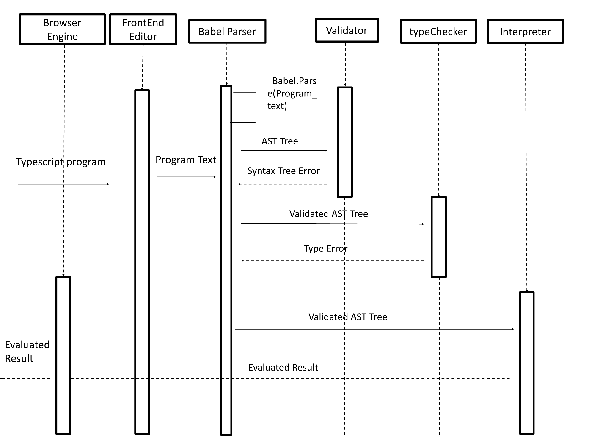

Build
=====

To build,

``` {.}
$ git clone https://<url>/x-slang.git
$ cd x-slang
$ yarn
$ yarn build
```

To add \"x-slang\" to your PATH, build it as per the above
instructions, then run

``` {.}
$ cd dist
$ npm link
```

If you do not wish to add \"x-slang\" to your PATH, replace
\"x-slang\" with \"node dist/repl/repl.js\" in the following examples.

To try out *Source* in a REPL, run

``` {.}
$ x-slang '1 * 1'
```

Hint: In `bash` you can take the `PROGRAM_STRING` out
of a file as follows:

``` {.}
$ x-slang "$(< my_source_program.js)"
```

Usage
====
This project has been integrated with ***Cadet Frontend***. User can easily input their TypeScript code in the code editor on the left side. After clicking ***Run*** button, user is able to get evaluated value
from the output block on the right side. For example:

``` TypeScript
function add(x:number, y:number = 6) {
  return x + y
}

add(5)
```

Type Annotation is a quite essential part for TypeScript language,
so we also implement a simple version of runtime type checker for the interpreter, user can check error
message about type in the console of the browser. For example
```TypeScript
let a:number = 1
let b:string = 'content'
a = b
// Error: The type of assigned value doesn't match the annotation type: string assigned to number
```


Documentation
=============

**TypeScript-Slang** is a metacircular interpreter written in TypeScript to implement a subset of 
TypeScript runtime.

Components (Sequential Diagram)
=======


Babel Parser
=======

The Babel parser (previously Babylon) is a JavaScript parser used in Babel.
- The latest ECMAScript version enabled by default (ES2020).
- Support for JSX, Flow, Typescript.
- Comment attachment.

API
``` TypeScript
babelParser.parse(code, [options])
babelParser.parseExpression(code, [options])
```
`parse()` parses the provided `code` as an entire ECMAScript program, while `parseExpression()` tries to parse a single Expression with performance in mind. When in doubt, use `.parse()`.

Output

The Babel parser generates AST according to Babel AST format. It is based on ESTree spec with the following deviations:

- Literal token is replaced with StringLiteral, NumericLiteral, BigIntLiteral, BooleanLiteral, NullLiteral, RegExpLiteral
- Property token is replaced with ObjectProperty and ObjectMethod
- MethodDefinition is replaced with ClassMethod
- Program and BlockStatement contain additional directives field with Directive and DirectiveLiteral
- ClassMethod, ObjectProperty, and ObjectMethod value property's properties in FunctionExpression is coerced/brought into the main method node.
- ChainExpression is replaced with OptionalMemberExpression and OptionalCallExpression
- ImportExpression is replaced with a CallExpression whose callee is an Import node.

This is how we call Babel parser in the project

```TypeScript
else if (context.variant === 'typescript') {
    const file = babelParse(source, {
      sourceType: 'module',
      plugins: [
        'typescript', // Parse Typescript syntax instead of Javascript syntax
        'estree', // Conform to the ESTree AST specification
        'classProperties' // Enable class option for AST parser
      ]
    })
```

Interpreter Feature
=======

### Variable Declaration Expression
Typescript-Slang has two kinds of variable declarations

- let:
    Declares a block-scoped, local variable, optionally initializing it to a value
    
- const:
    Declares a block-scoped, read-only named constant. A constant cannot change value through assignment or be re-declared while the script is running. It must be initialized to a value
    
You use variables as symbolic names for values in your application. The names of variables, called identifiers can also be told what the types it should be when being initialized. 
```TypeScript
let a = 5
a + 6
// 11

let a:number = 'content'
// Error: The type of assigned value doesn't match the annotation type: string assigned to number
```
```TypeScript
let f;
for (let i = 0; i < 10; i = i + 1) {
    if (i === 0) {
        f = () => i
    }
}
f();
// 0
```

### UnaryExpression
Unary operator: !
```TypeScript
!true
// false
```

### BinaryExpression
Binary operator: +, -, *, /, %, >, <, >=, <=, ===, !==, ||, &&
```TypeScript
1 + 2;
// 3
1 >= 6;
// false
6 < 12;
// true
1 === 4;
//false
```

### ConditionalExpression
Conditional operator: ?
```TypeScript
false ? 1 : 2
// 2
```

### UpdateExpression
Update operator: ++, --
```TypeScript
let a = 0
a++
// 1
```

### IfStatement
The if statement executes a statement if a specified condition is truthy. If the condition is falsy, another statement can be executed.
```
if (condition) {
   statement1
} else {
   statement2
}
```

```TypeScript
function testNum(a) {
  let result;
  if (a > 0) {
    result = 'positive';
  } else {
    result = 'NOT positive';
  }
  return result;
}

testNum(10)
// positive
```

### ContinueStatement
The continue statement terminates execution of the statements in the current iteration of the current or labeled loop, and continues execution of the loop with the next iteration.
```TypeScript
let a = 1;

for (let i = 0; i < 10; i++) {
  if (i === 3) {
    continue;
  }
  a = a + i;
}
// 42
```

### BreakStatement
The break statement terminates the current loop, switch, or label statement and transfers program control to the statement following the terminated statement.
```TypeScript
let i = 0;

while (i < 6) {
  if (i === 3) {
    break;
  }
  i = i + 1;
}

i;
// 3
```

### ReturnStatement
The return statement ends function execution and specifies a value to be returned to the function caller.
```TypeScript
function add(x, y) {
    return x + y;
}
add(1,2)
// 3
```

### BlockStatement
A block statement (or compound statement in other languages) is used to group zero or more statements. The block is delimited by a pair of braces ("curly brackets") and may optionally be labelled:
```TypeScript
let i = 0
if(true) {
    let i = 10
}
i;
// 0
```

### Assignment Expression
The simple assignment operator (=) is used to assign a value to a variable. The assignment operation evaluates to the assigned value. 
```TypeScript
let a:number = 5
a = 'content'
// Error: The type of assigned value doesn't match the annotation type: string assigned to number

const a = 5
a = 6
// Line 2: Cannot assign new value to constant a.
```

### Array Expression
``` TypeScript
let a = [1, 'content', true, 0]
a
// [1, "content", true, 0]

let matrix = [[0,1,0,0,0],[1,0,0,1,0],[1,1,1,1,1]]
matrix[0][0] = -1
matrix
// [[-1, 1, 0, 0, 0], [1, 0, 0, 1, 0], [1, 1, 1, 1, 1]]
```

### For & While Statement
For loop:

A for loop repeats until a specified condition evaluates to false. 

A for statement looks as follows:

```
for ([initialExpression]; [conditionExpression]; [incrementExpression]) {
  statement
}
```

while loop:

A while statement executes its statements as long as a specified condition evaluates to true.

```
while (condition)
  statement
```

```TypeScript
let a = 5
for(let i=0; i<10; i++) {
    if(i<9) continue
    a = a + 1
}
a
// 6

let a = 0
while(a<100) {
    if(a === 50) break
    a++
}
a
// 50
```

### Function declaration & Function Expression & Calling Function
A function declaration consists of the function keyword, followed by:

1.The name of the function.


2. A list of parameters to the function, enclosed in parentheses and separated by commas.

3.The statements that define the function, enclosed in curly brackets, {...}.

While the function declaration above is syntactically a statement, functions can also be created by a function expression.

Calling the function actually performs the specified actions with the indicated parameters

You may nest a function within another function. The nested (inner) function is private to its containing (outer) function.

It also forms a closure. A closure is an expression (most commonly, a function) that can have free variables together with an environment that binds those variables (that "closes" the expression).

Since a nested function is a closure, this means that a nested function can "inherit" the arguments and variables of its containing function. In other words, the inner function contains the scope of the outer function.

```TypeScript
function makeAdder(x) {
  return function(y) {
    return x + y
  };
}

let add5 = makeAdder(5)
add5(9)
// 14
```

```TypeScript
let add = function(a, b) {return a + b}
let res = add(3,4)
// 7
```

```TypeScript
let f;
for (let i = 0; i < 10; i = i + 1) {
    if (i === 0) {
        f = () => i
    }
}
f();
// 0
```

### Arrow Function
An arrow function expression (previously, and now incorrectly known as fat arrow function) has a shorter syntax compared to function expressions and does not have its own this, arguments, super, or new.target. Arrow functions are always anonymous.

```TypeScript
let f
for (let i = 0; i < 10; i = i + 1) {
    if (i === 0) {f = () => i}
}
f()
// 0
```

### This & Member Expression
Use the this keyword to refer to the current object. In general, this refers to the calling object in a method. Use this either with the dot or the bracket notation:
```TypeScript
function add(x, y) {
  this.name = x;
  this.id = y;
  this.sum = function(){
    return this.name + this.id
  }
}

let a = new add(1,3)
a.sum()
// 4
```

Runtime TypeChecker
=======
The typechecker consists of two parts, one is `traverse()`, another is `infer()`

`traverse()` will recursively go through all Nodes in the AST structure and check whether all Nodes are satisfied with the requirement to process by type inference and interpreter.

Similar to the interpreter, `infer()` will recursively "evaluate" the "returned inferred type" from Nodes.
```TypeScript
export function typeCheck(
  program: TypeAnnotatedNode<es.Program>,
  context: Context
): [TypeAnnotatedNode<es.Program>, SourceError[]] {
  typeIdCounter = 0
  typeErrors = []
  const env: Env = context.typeEnvironment
  const constraints: Constraint[] = []
  traverse(program)
  try {
    infer(program, env, constraints, true)
  } catch (e) {
    console.log(e)
  }
  traverse(program, constraints)
  return [program, typeErrors]
}
```

Extra Features
=======
## Default Parameter
When you declare a function, you can pre-assign value to parameters as default value
```TypeScript
function add(x:number, y:number = 0, z:number = 0) { 
  return x + y + z
}
add(4)
// result: 4
```

## OOP feature support
You can use the new operator to create an instance of a user-defined object type or of one of the built-in object types. Use new as follows:
```
function Person(name, age, job) {
    this.name = name;
	this.age = age;
	this.job = job;
	this.sayName = function() {
		return this.name
	}
}

let person1 = new Person("Nicholas", 20, "software engineer")
// {name:"Nicholas", age:20, job: "software engineer"}
```

You can decalre a object and access it's properties. 
```typescript
let a = {
	name:"Nicholas",
	age:20,
	job: "software engineer"
}
a.name
// result: "Nicholas"
```


You can initialize an object with construct function. 
```typescript
function Person(name, age, job) {
    this.name = name;
	this.age = age;
	this.job = job;
	this.sayName = function() {
		return this.name
	}
}

let person1 = new Person("Nicholas", 20, "software engineer")
person1.sayName()
// result: "Nicholas"
```


You can set a prototype to the construct function so that the object being initialized with that construct function will inherit properties 
from the prototype. 
```typescript
function Persion(){}

Person.prototype.name = "Nicholas";
Person.prototype.age = 20;
Person.prototype.job = "software engineer";
Person.prototype.sayName = function() {
    return this.name;
}

let person1 = new Person();
person1;
// result: {}
person1.sayName();
// result: "Nicholas"
```

TypeScript Slang Specification
=======
The language specification for TypeScript is quite similar to ***Source Chapter 4***. We define it with
Backus-Naur form as below:

```
statement ::= const constname=expression;
            |let;
            |assignment;
            |expression[expression] =expression;
            |functionname(parameters)
            |returnexpression;
            |if-statement
            |while (expression)
            |for ((assignment|let);expression;assignment)
            |break;
            |continue;
            |block
            |expression;
parameters::=|name(,name)...
if-statement::=if (expression)block
               else(block|if-statement)
block::={statement...}
let::=letname=expression
assignment::=name=expression
expression::=number
           |true|false
           |string
           |null
           |name
           |expression binary-operator expression
           |unary-operator expression
           |expression(expressions)
           |(name|(parameters))=>expression
           |(name|(parameters))=>block
           |expression?expression:expression
           |expression[expression]
           |[expressions]
           |{name:expression}
```

Testing
=======
`x-slang` comes with an extensive test suite. To run the tests after you made your modifications, run 
`yarn test`. Regression tests are run automatically when you want to push changes to this repository. 
The regression tests are generated using `jest` and stored as snapshots in `src/\_\_tests\_\_`.  After modifying `x-slang`, carefully inspect any failing regression tests reported in red in the command line. If you are convinced that the regression tests and not your changes are at fault, you can update the regression tests as follows:  
``` {.}
$ yarn test -- --updateSnapshot
```

Error messages
==============

To enable verbose messages, have the statement `"enable verbose";` as the first line of your program.

There are two main kinds of error messages: those that occur at runtime
and those that occur at parse time. The first can be found in
`interpreter-errors.ts`, while the second can be found in `rules/`.

Each error subclass will have `explain()` and `elaborate()`. Displaying the
error will always cause the first to be called; the second is only
called when verbose mode is enabled. As such, `explain()` should be made
to return a string containing the most basic information about what the
error entails. Any additional details about the error message, including
specifics and correction guides, should be left to `elaborate()`.

Please remember to write test cases to reflect your added
functionalities. The god of this repository is self-professed to be very
particular about test cases.

Using your x-slang in local Source Academy
===========================================

A common issue when developing modifications to js-slang is how to test
it using your own local frontend. Assume that you have built your own
cadet-frontend locally, here is how you can make it use your own
js-slang, instead of the one that the Source Academy team has deployed
to npm.

First, build and link your local js-slang:
``` {.}
$ cd x-slang
$ yarn build
$ yarn link
```
Then, from your local copy of cadet-frontend:
``` {.}
$ cd cadet-frontend
$ yarn link "x-slang"
```

Then start the frontend and the new js-slang will be used. 
